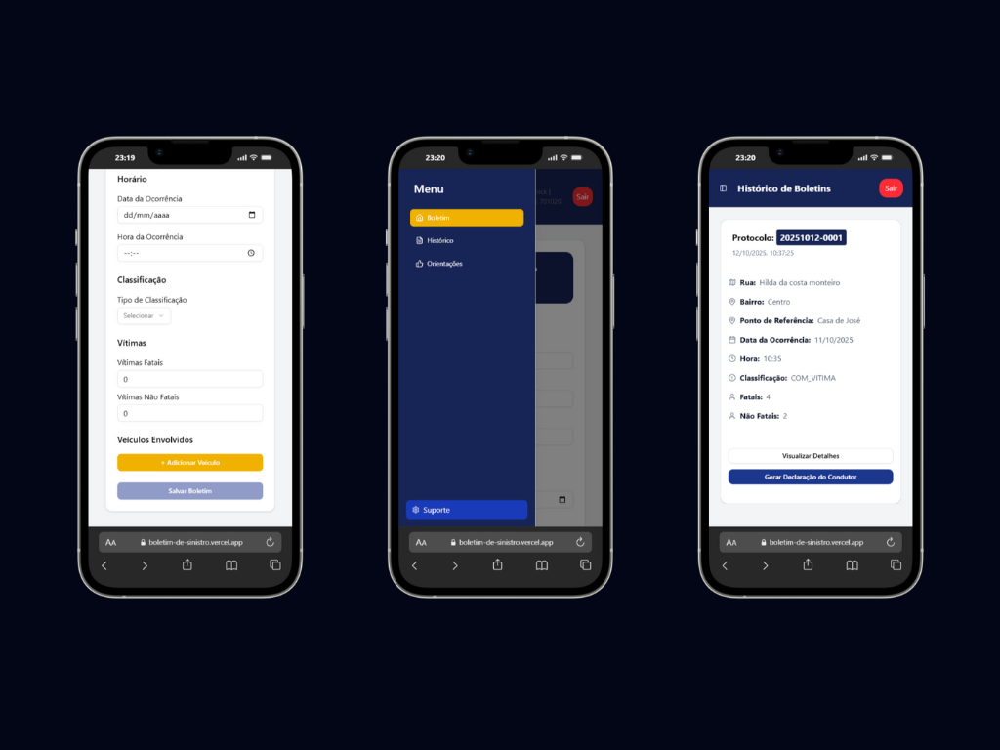
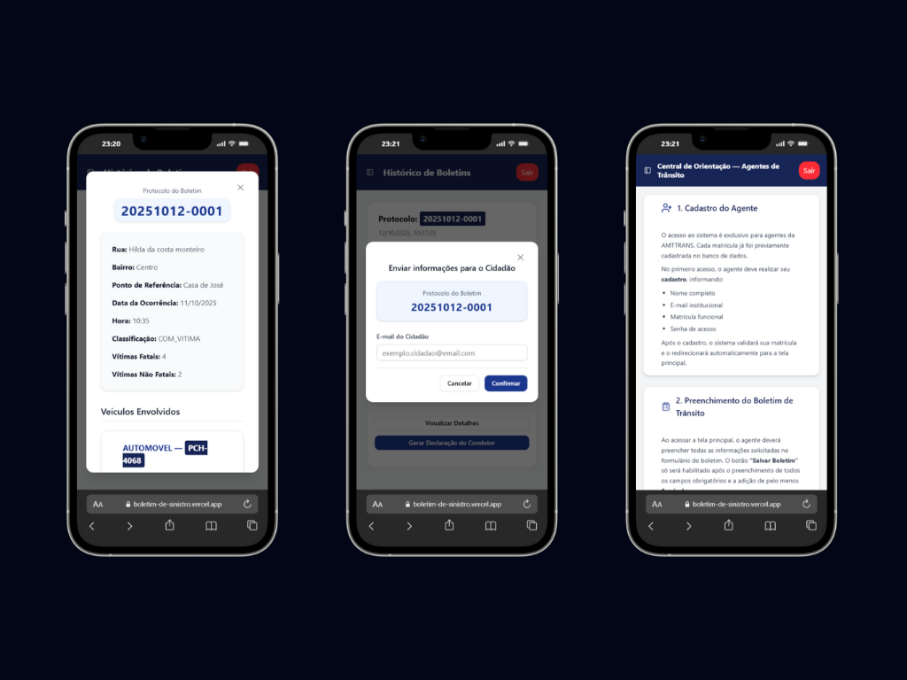

<h1 align="center">
  
</h1>

  <strong>Central Operacional de Sinistros - AMTTRANS</strong> 
  Processo de contratação e licenciamento — 2025

  

  

  

## 💻 Sobre o projeto

Central Operacional de Sinistros

O software foi desenvolvido para tornar o registro e o acompanhamento de sinistros de trânsito mais ágeis, precisos e padronizados.
Criado especialmente para a Autarquia Municipal de Trânsito e Transporte AMTTRANS, o sistema centraliza informações, automatiza processos e oferece uma visão completa das ocorrências de sinistros de trânsito.

Seja no atendimento, na gestão ou na análise de dados, a solução foi projetada para atender às demandas operacionais do setor público, promovendo **eficiência na gestão de informações**, **padronização dos registros** e **redução de processos manuais**.

Atualmente, o projeto encontra-se **em fase de contratação e licenciamento**, desenvolvido e mantido por **[Erick Welberth / Nuxt]**, com foco em implantação e suporte dedicado à AMTTRANS.

## ⚙️ **Funcionalidades**

- [ ] **Autenticação de Usuário:** Login e cadastro utilizando _Better Auth_, com persistência de dados no banco **PostgreSQL**.
- [ ] **Gestão de Sessão:** Dados do usuário armazenados de forma segura com **PrismaORM**.
- [ ] **Preenchimento de Boletim:** Formulário completo para registro de sinistros de trânsito.
- [ ] **Múltiplos Veículos:** Opção para adicionar mais de um veículo envolvido no mesmo boletim.
- [ ] **Registro de Infrações:** Campo dedicado para adicionar infrações de trânsito associadas ao sinistro.
- [ ] **Validação de Envio:** O botão de registro é habilitado apenas após o preenchimento de todos os campos obrigatórios e inclusão de pelo menos um veículo.
- [ ] **Menu de Navegação:** Acesso rápido às páginas e módulos do sistema.
- [ ] **Página de Histórico:** Exibição de todos os boletins registrados pelo agente, com visualização organizada.
- [ ] **Número de Protocolo Único:** Cada boletim recebe um identificador exclusivo gerado automaticamente.
- [ ] **Visualização Detalhada:** Opção de abrir cada boletim para consultar informações completas do registro.
- [ ] **Geração de Declaração:** Emissão automática da declaração do condutor, com envio via e-mail e validação de protocolo.
- [ ] **Envio de Comprovação:** Envio automático de e-mail ao condutor com a confirmação do registro e o documento para preenchimento manual.
- [ ] **Central de Orientação:** Área dedicada a orientações e boas práticas para o agente de trânsito utilizar o sistema de forma eficiente.

## 🛠️ Ferramentas

- [ ] **Next.js**
- [ ] **TypeScript**
- [ ] **TailwindCSS**
- [ ] **ShadCN**
- [ ] **Lucide React**
- [ ] **Framer Motion**
- [ ] **React Hook Form**
- [ ] **Zod**
- [ ] **Better Auth**
- [ ] **Axios**
- [ ] **PrismaORM**
- [ ] **NeonDB**
- [ ] **Date-fns**
- [ ] **Nodemailer**
- [ ] **React Hot Toast**
- [ ] **Vercel**
- [ ] **Git**
